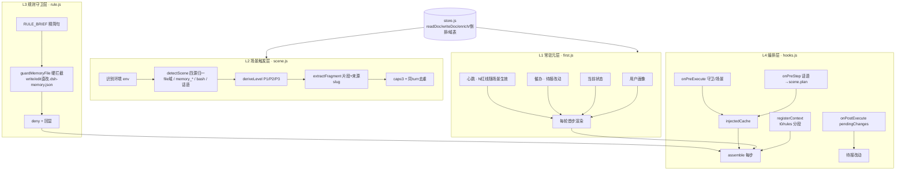
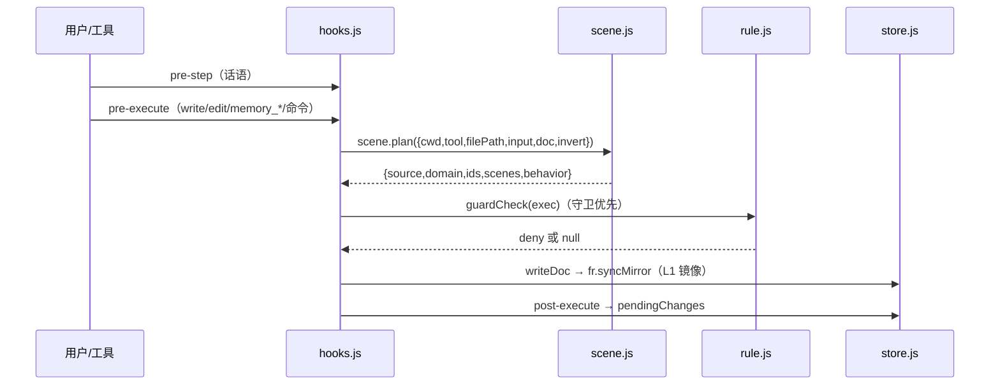

# 🌟 北极星记忆（dsh-project-memory）· Project Memory Plugin for DeepSeek Harness

> **版本**：0.1.3 · **许可证**：BSD-3-Clause · **类型**：DeepSeek Harness（DSH）插件 · **适配核心**：DSH **v0.1.5-rc.1 及更新**（web/desktop profile 通用；桌面端 2.0.7+，实测 2.0.9 / 核心 0.1.5-rc.1）
> **版本线**：🚀 **单线（0.1.3）** —— 2026-09-11 起取消双线，**只跟随 DSH 最新核心，不再为旧核做适配**；旧的自用稳定线 0.1.4 已归档（`D:\Agent共享\DSH插件\归档-legacy线-20260911\`）。**只有出现较大优化或新功能时才升 0.2.0**；**本版暂不发布**（0.1.4/0.1.5 这两个双线版本号作废）。详见 [`VERSION-LINES.md`](./VERSION-LINES.md)
> **0.1.3 界面修复·第三轮（2026-09-12 用户实测驱动）**：① 修复「点目录输入框却输入到搜索框」——根因是搜索框的 `autoFocus` 与**回调 ref 里的 focus()**（React 每次渲染都重新调用回调 ref → 每次抢焦点）；最终改为**结构性根治：搜索框收起时从 DOM 卸载**（`searchOpen ? slot : null`，元素不存在则物理上无法被抢焦点）。② 修复目录输入框「点一下就闪、无法输入」——旧写法 `onFocus` 打开下拉 + `onBlur` 延迟 150ms 关闭互相触发形成闪烁循环，且每次聚焦都发一次 `/projects` 请求；改为聚焦幂等加载 + 仅在有匹配项时渲染下拉。③ **记忆胶囊在展开搜索时缩成纯数字**（88→44px），配合搜索框 130→100px，使展开态总宽 612→540px，正好装进设置面板（此前胶囊会被顶出屏幕）。④ 精简过长提示文本（目录框/搜索框）。⑤ 新增多重防回退断言：焦点守卫（禁止 autoFocus、ref 回调禁含 focus、focus 调用≤2 处）、CSS 冲突守卫、反引号守卫、渲染块唯一性、数字居中断言。

> **0.1.3 项目目录 Typeahead（2026-09-11 用户需求）**：「项目目录」输入框现在**回车即加载**该目录的记忆（原来只有点「保存」才行），聚焦时弹出**可搜索下拉**列出"现有项目"——数据来自宿主 `collectProjects`（本进程见过的项目目录 + 活跃会话的工作目录，每条带记忆条数；**只列真有 `.dsh-memory.json` 的目录**）合并浏览器本地"最近使用"；输入即过滤、↑↓ 选择、Enter/鼠标点选即切换项目、Esc 关闭。**历史只在明确提交时记录**（回车/保存/选择目录/下拉选择），输入过程不会产生垃圾记录；旧的半截路径由 `cleanRecentDirs` 自动清理。
> **0.1.3 导入向导（2026-09-11 用户需求）**：设置页「导入」选好 JSON 文件后**先弹确认框**——插件已为每条自动判断**分类**（项目/参考/反馈/用户/技能/知识）与**重要等级**（特定情况/长期有效/阶段）、按正文**生成标题与简介**并自动排版；不满意可直接改分类/等级/标题/简介，点「确定导入」才写盘（与其它写入同一套服务端回读校验，绝不谎报成功）。导入的记忆**置顶**放进列表，分类分组后即显示在各组顶部，便于区分；id 与现有记忆或本批内重复时自动换新 id。
> **0.1.3 统一优先级（2026-09-11 用户定调）**：**拖动排序 = 「保存排序」** —— 两者走同一条写盘路径（`/save`，服务端 `explicitOrder` 落盘），且都做**服务端回读校验**：只有 `verified` 才算"存住了"；失败或回读不一致时按磁盘真实顺序刷新界面并如实提示（绝不谎报成功），保存后都有 10 秒撤销。手动（默认）模式显示的就是文件里的真实顺序 → **重启后看到的永远是你最后摆的样子**。
> **0.1.3 修复（重要·2026-09-11 用户实测发现）**：保存的排序**一有写入就被冲掉、重启后回退**。病根：`writeThrough` 虽是唯一写入口，但所有「顺带写入」（召回热度自增、记忆增删改）都是"默认读 `readDoc`（按最新重排）→ 原样写回"，于是手动顺序当场被重排。现 `writeThrough` **默认保序**（把要写的集合套回磁盘现有顺序；磁盘上没有的新记忆放最前），**只有设置页 `/save` 显式改序**（`explicitOrder:true`）才按客户端顺序落盘。回归测试：`test/save-order-survives-writes.test.mjs`（6 项，含"修复前必然失败"的反证：保存 a,c,b → 3 次热度自增 → 修复前变 c,b,a、修复后仍 a,c,b）+ `test/client-drag-save-wiring.test.mjs`（5 项拖动接线）。
> **0.1.3 修复（前一轮）**：手动顺序以前**根本显示不出来** —— `readDoc` 每次读盘都按"最新"重排，写进去的手动/保存顺序一读就被冲掉（拖动排序也一直因此无效）。现读取新增 `keepOrder`：设置页 `/list` 返回**文件真实顺序**；`/save` 写盘后**回读校验**并返回 `verified`，客户端据此才报成功（不一致就提示"未生效"并重载磁盘实际顺序）。
> **0.1.3 交互**：点「保存排序」先弹**二次确认**弹窗 → 确认后写盘 → 回读校验通过 → 弹**成功告知弹窗（3 秒自动关闭）**；默认（手动）模式下按钮不显示；保存后 10 秒内仍可撤销。
> **一句话**：让 AI 一直记住你的项目 —— 每轮带着你的习惯、改东西时自动提醒规矩、提到相关内容自动翻出来，重要记忆还能上锁防删。

---

## ② 大白话说明（For Users / 小白版）

### 这个插件是干嘛的？
AI 记性不好?聊着聊着就忘了你之前说过的重要事。**北极星记忆**就是给 AI 装一个"项目记事本"：

- **你告诉它的事，它帮你分好类存起来**（项目进度、踩坑经验、你的偏好……）。
- **以后每轮对话**：它**自动记得你的习惯**（比如"用大白话交流"、"图标要极简风"）。
- **你改文件/改记忆时**：它**自动提醒**你该注意的规矩（比如"改完要报告文件位置"）。
- **你聊到相关内容时**：它**自动翻出来**（你说"怎么合并记忆"，它翻出"冗余治理"那条）。
- **重要记忆**：你可以说"禁止删除 XX"，它给那类记忆**上锁**——AI 想删会被拦，你自己想删会弹窗确认（你是主人）。

### 怎么用？（照做就行）
| 你想干嘛 | 怎么做 |
|---|---|
| 让我记住一件事 | 直接说"帮我记住：XXX"（会弹窗让你确认） |
| 查记忆 | 说"查一下 XXX"（我用工具翻出来） |
| 改/删记忆 | 说"把 XX 改成 YY"或"删掉 XX"（弹窗确认） |
| 设一条不许碰的底线 | 说"记住：禁止删除 XX"→ 弹窗选"允许并装硬守卫" |
| 看插件状态 | 输入 `/memory status` |
| 看当前有哪些锁 | 输入 `/memory guard`（或 `/memory guard list`） |
| 卸掉某把锁 | 输入 `/memory guard remove <序号>` |
| 记忆归档/取消 | 说"把 XX 归档"（弹窗会告诉你归档后不打扰、锁自动失效） |

### 记忆分类（简单版）
- **project** 项目进度/事实 · **feedback** 踩坑经验 · **user** 你的偏好习惯 · **reference** 资料 · **skill** 学会的用法 · **knowledge** 通用知识

### 它怎么"记得刚刚好"（不啰嗦）
- **你的画像**：每轮都在（不丢）。
- **红线/规矩**：改文件时提醒。
- **普通知识**：聊到才出现，平时不打扰。
- **读文件**：不打扰（只在你改动时才提醒）。

### 安全
- 改记忆必须**你弹窗确认**（你同意才改）。
- 记忆文件（`.dsh-memory.json`）**只能用专用工具改**（直改会被拦）。
- 重要记忆**上锁**（AI 删不了，你能删但要确认）。
- **装一次全生效，卸干净不留垃圾**（记忆文件本身保留）。

---

## ① 专业说明（For Developers / 硬核版）

### 架构总览（mermaid 图）


### 注入层级（tiered injection）
| 层 | 模块 | 职责 | 触发 |
|---|---|---|---|
| **L1 常驻元层** | `lib/first.js` | 用户画像 + 当前状态 + 催办 + 心跳行；**首步真身**（`syncWarm` 同步读盘，`readDocSync`，cold-start 不空段） | 每轮首步（step0 门控） |
| **L2 场景触发** | `lib/scene.js` | `detectScene`（文件域/记忆操作/命令/话语倒排四源归一）→ `deriveLevel`（P1=obligation‖pinned / P2=ttl permanent,phase / P3=其余）→ `extractFragment`（title+命中行+[来源:slug]，≤110 字）→ `cap3` 去重 → `P1 置顶` | 场景命中时（写/读/记忆/命令/话语） |
| **L3 规则守卫** | `lib/rule.js` | 规则精简句（`RULE_BRIEF`）+ 记忆场景全量（`ruleFull` 含"为什么"）+ **硬守卫**（`guardMemoryFile` 拦直改 `.dsh-memory.json` → deny+回显）；**底线记忆 → 硬守卫**（`proposeGuard` 识别禁止语义 → 三选项授权弹窗 → `guard` 字段进记忆 → `rebuildGuardTable` 内存表 → hooks 拦截） | 规则场景化；硬守卫 pre-execute 在 approval 前 |
| **L4 编排** | `lib/hooks.js` | `registerContext`（t0/rules 分段）+ 三监听器（pre-step/pre-execute/post-execute）编排，唯一接触 ctx 层 | register(ctx) 一次 |

### 数据流


### 底线记忆 → 硬守卫（机制）
```
写"禁止删除记忆A" → proposeGuard（只认禁止语义；义务词必须/记得/每次只走 P1 提醒）
  → 三选项弹窗（允许(仅记忆) / 允许并装硬守卫(规格全文) / 拒绝）——用户中心：判目标重要性（P1 赞成；P2/P3 提醒但尊重）
  → guard {action: block_write|block_update|block_delete, target: {kind: memory|path, ...}} 落盘（零 schema）
  → rebuildGuardTable(doc)（writeDoc 后单点重建；archived 载体不守卫）→ hooks pre-execute 拦截（deny 优先于 approval）
  → AI 工具删：deny；用户 /memory delete：守卫命中→弹窗确认（可绕，不对称性：守卫约束 agent 不约束用户）
  → /memory guard list|remove（可逆）；/memory status 守卫数+blockedCount 审计落盘
```

### 关键实现约定
- **零 schema**：guard 字段进记忆记录（随记忆生命周期；旧客户端 save 丢字段 → status 按守卫数下降告警）。
- **injectMode**：`scenario`（默认，场景触发+等级+片段 / legacy-full（旧路径金丝雀，保留至切换验证）。
- **无害降级**：某服务缺失 → 探测→退化→上报；`readDocSync` 失败 → 存根 + `isStuck`（warming-too-long）。
- **性能**：每轮 O(1)（L1 常驻 + L2 ≤3 + 守卫表内存查询）；无 LLM 调用（全确定性）。

### 文件结构
```
lib/
├─ index.js      # 入口：apply 装配 + injectMode 分流 + 5 工具 + /memory + RPC + 守卫弹窗
├─ store.js      # 存储层：readDoc/writeDoc/enrichMemory/倒排/域表/activeOnly/parseDoc/readDocSync
├─ first.js      # L1 常驻元层：firstCache 同步镜像/存根/renderFirst/syncWarm
├─ scene.js      # L2 场景触发：detectScene/deriveLevel/extractFragment/rankScene/renderScene
├─ rule.js       # L3 规则守卫：RULE_BRIEF/ruleFull/proposeGuard/rebuildGuardTable/dragGuardCheck
├─ hooks.js      # L4 编排：registerContext + 三监听器
├─ client.js     # 设置页 UI（记忆列表/编辑/删除/排序/搜索/多项目切换）
├─ types/        # 类型声明
└─ inject-README.md # 注入重做内部笔记
```

### 测试
```bash
node --test          # 回归（roundtrip/m4-recall/guard 等）
node lib/rule.js     # rule.js selfTest（守卫语义 30+ 断言）
node lib/scene.js    # scene.js selfTest（场景管线 31 断言）
```

### 发布（publish）
- `dsh.bundle.patch` 指向 `./cordis.patch.yml`（插件行）；`exports ./client`（设置页 UI）；`files` 含 `lib` + `cordis.patch.yml` + `README.md` + `LICENSE`。
- 分发路一：`npm publish` → `dsh plugin add dsh-project-memory`；路二：GitHub repo 直装（`install github:owner/repo`）。

---

## 兼容性 Compatibility

| 项 | 说明 |
|---|---|
| **适配核心版本** | DeepSeek Harness **v0.1.2-rc.1 ~ v0.1.5-rc.1**（同代 rc——`@deepseek-ai/dsh-tools >=0.1.5-rc.1` / `@deepseek-ai/cordis >=4.0.0-rc <5`，见 package.json peerDependencies）；随核心快速适配（探测→退化→上报）。**0.1.5-rc.1 适配核对**：29 项 API 静态核对全通过 + apply() 冒烟（含"无 webServer 的桌面壳"场景）全通过 |
| **Profile** | `web`（桌面端/网页 profile 均以 `--profile <名字>` 指定；本插件 profile 无关——纯平台插件，web/desktop 通用；实测 `profiles/web`） |
| **平台** | 宿主 `node` + 客户端 `web`（设置页 UI）——零构建依赖 |

## 安装 Install

**前置**：已安装 DSH 并可用 `dsh` CLI（`dsh -h` 有输出即就绪）。

```bash
# npm 市场（发布后）——装到指定 profile（默认 web）
dsh plugin --profile web add dsh-project-memory

# 或本地 tarball
npm pack
dsh plugin --profile web add ./dsh-project-memory-0.1.0.tgz

# 或 GitHub 源（需 prepare 构建 / 用户放行 allowBuilds）
dsh plugin --profile web add github:your-name/dsh-project-memory
```
装后**重启 DSH** 生效；设置页出现「北极星·项目记忆」= 客户端已挂载。

## 功能 Features（表格）

| 能力 | 工具/入口 | 说明 |
|---|---|---|
| 读记忆 | `memory_read` | 按 id/title/query 读 |
| 语义召回 | `memory_recall` | IDF+unigram 词法 + 同义词层（跨说法召回） |
| 写记忆 | `memory_write` | 6 类 + 自动打标（域 tags/别称/义务）+ 确认门 |
| 改记忆 | `memory_update` | 字段级更新 + 确认门 + 归档去向提示 |
| 删记忆 | `memory_delete` | 确认门 + 硬守卫拦截 |
| 待报清 | `memory_pending_changes` | 改动文件清单 |
| 命令 | `/memory status|list|guard\|delete\|add\|state` | 状态/守卫/管理 |
| UI | 设置页·北极星·项目记忆 | 列表/编辑/删除/排序/搜索/多项目 |

## 硬守卫（底线记忆）Hard Guard

> 见上方"底线记忆 → 硬守卫"机制。**不对称性**：守卫约束 agent，永不约束用户（用户是主人；设置页/`/memory delete` 弹窗确认可绕）。**已知限制**：路径子串误伤（弹窗规格展示用户肉眼兜底）；shell 间接写不在守卫内；义务语义不可守卫（"忘记做 X"只能 P1 提醒）。

## License

BSD-3-Clause（详见 LICENSE）。

---

## 致谢

- DeepSeek Harness 插件生态（dsh-market / awesome-dsh-plugin / dsh-plugin-registry）。
- 设计评审：GLM（注入重做 L1/L2/L3 + 底线记忆硬守卫机制定稿）。

---

# English README

> **Polaris Memory (dsh-project-memory)** — Project Memory Plugin for DeepSeek Harness
> **Version**: 0.1.2 · **License**: BSD-3-Clause · **Core**: DSH v0.1.2-rc.1 ~ v0.1.5-rc.1 (web/desktop profiles)

## For Developers (Professional)

### What it does
A local-first, per-project memory plugin. Each project gets one `.dsh-memory.json` (cwd-isolated). It provides 5 model tools (`memory_read/recall/write/update/delete`), the `/memory` command, and a settings-page UI (list/edit/delete/reorder/search/multi-project).

### Architecture (tiered injection)
| Layer | Module | Responsibility | Trigger |
|---|---|---|---|
| **L1 Persistent Meta** | `lib/first.js` | user profile + state + pending-changes + heartbeat; first-step real data (`syncWarm` sync read, `readDocSync`, no empty stub) | every turn, first step |
| **L2 Scene** | `lib/scene.js` | `detectScene` (file-domain / memory-op / command / utterance inverted-index) → `deriveLevel` P1/P2/P3 → `extractFragment` (title+matching line+`[来源:slug]`) → cap3 dedupe → P1 top | scene hit (write/read/memory/command/utterance) |
| **L3 Rule & Guard** | `lib/rule.js` | brief rule (`RULE_BRIEF`), full rule on memory op (`ruleFull`), **hard guard** (`guardMemoryFile` blocks direct `.dsh-memory.json` edits → deny+feedback); bottom-line memory → hard guard (`proposeGuard` deny-semantics → 3-option auth → `guard` field → `rebuildGuardTable` → hook intercept) | scene-based rules; guard pre-execute before approval |
| **L4 Orchestration** | `lib/hooks.js` | `registerContext` (t0/rules segments) + 3 listeners (pre-step/pre-execute/post-execute) | `register(ctx)` once |

### Key conventions
- **Zero schema**: `guard` field lives in the memory record; `injectMode`: `scenario` (default) / `legacy-full` (golden path).
- **Degrade safely**: capability probe → degrade → report; `readDocSync` failure → stub + `isStuck` (`warming-too-long`).
- **O(1) per turn**: L1 resident + L2 ≤3 + in-memory guard table; fully deterministic (no LLM call).

### Install
```bash
# npm (after publish)
dsh plugin --profile web add dsh-project-memory
# tarball
npm pack && dsh plugin --profile web add ./dsh-project-memory-0.1.0.tgz
# GitHub source
dsh plugin --profile web add github:your-name/dsh-project-memory
```
Restart DSH; the settings page shows **Polaris · Project Memory** when the client is mounted.

## For Users (Plain English)

### What this does
Makes the AI remember your project: it saves important things you tell it, automatically brings your habits every turn, reminds you of rules when you edit files, and surfaces related knowledge when you talk about it. Critical memories can be **locked** (AI can't delete them; you can, after a confirm dialog).

### Quick usage
| You want to | Do this |
|---|---|
| Save something | Say "remember: XXX" (confirm dialog) |
| Look something up | "search XXX" |
| Edit / delete | "change XX to YY" / "delete XX" (confirm) |
| Set a hard rule | "remember: never delete XX" → choose "allow + install hard guard" |
| Plugin status | `/memory status` |
| List locks | `/memory guard` |
| Remove a lock | `/memory guard remove <N>` |

### Memory types
`project` progress · `feedback` lessons · `user` your preferences · `reference` docs · `skill` how-to · `knowledge` general

### Safety
Memory changes need your confirm dialog; `.dsh-memory.json` can only be changed via the dedicated tools (direct edits are blocked); critical memories can be locked; install once, uninstall cleanly (memory file kept).

## License
BSD-3-Clause (see LICENSE).
